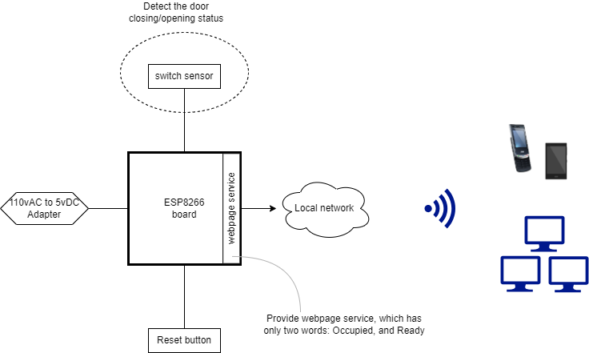
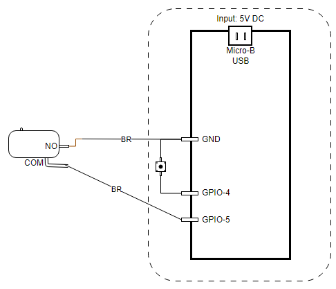

# RestroomToGo
## Introduction
There is only one washroom in Lincoln Appliance Service Centre office, and it is located in the middle of the building between the front shop and back shop. Although there is already a light hanging on the wall beside the washroom that is used to indicate the availability of the washroom, the light is not visible to all staff working in their own cubicles. Only some can see it directly. Now, via this project, all staff will be able to check the availability of the washroom from their computers and mobile phones if the devices have connected to the office's local network.

## Design

Notes: The "Reset button" in the above diagram is actually the button that is used to re-configure Wi-Fi connection.

## Hardware

1. Ai-Thinker NodeMCU-8266 v1.2 Development board x1
2. Micro push button x1

## Wiring Diagram

