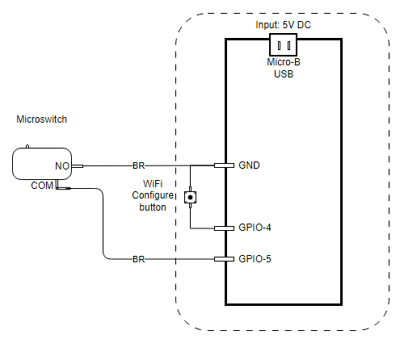

# RestroomToGo
## Introduction

This gadget is used to detect the restroom door opening/closing status, and provide web services for user 

## Hardware

1. Ai-Thinker NodeMCU-8266 v1.2 Development board          x 1
2. Micro push button                                                                      x 1

## Wiring Diagram

